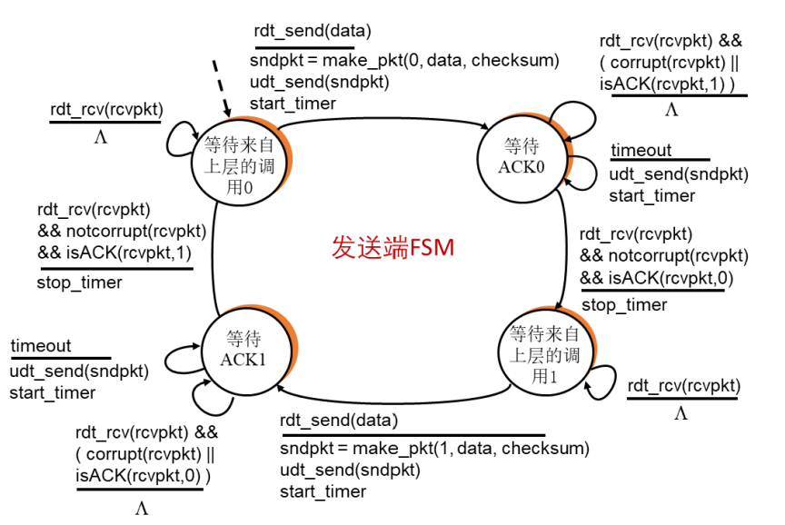
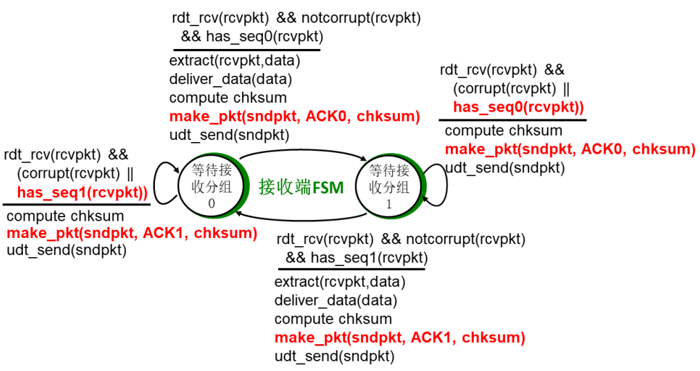

# lab3-1：基于UDP的可靠传输协议
- [lab3-1：基于UDP的可靠传输协议](#lab3-1基于udp的可靠传输协议)
  - [实验设计](#实验设计)
    - [程序执行过程](#程序执行过程)
    - [数据报格式](#数据报格式)
  - [流程说明](#流程说明)
    - [三次握手确认连接](#三次握手确认连接)
    - [三次挥手断开连接](#三次挥手断开连接)
    - [rdt3.0发送](#rdt30发送)
    - [rdt3.0接收](#rdt30接收)
  - [辅助函数](#辅助函数)
    - [计算校验和](#计算校验和)
    - [结束传输](#结束传输)
  - [运行结果](#运行结果)
  - [总结](#总结)
    - [连接与断开连接的思考](#连接与断开连接的思考)
    - [Router时延的观察](#router时延的观察)

## 实验设计
### 程序执行过程
本次实验设计了一个基于UDP的可靠传输协议，实现了**连接建立**、**文件传输**和**连接断开**三个过程，过程中涵盖了**超时重传**、**差错检测**等内容。  
Server与Client之间的通信借助Router进行转发，通过Router调节丢包率和延时，程序执行过程如下：
1. Client端发送连接请求，Server端接收连接请求，三次握手建立连接。
2. Client端载入文件，分组发送数据报；Server端接收数据报，发送确认数据报。
3. Client端将文件名同文件传输结束数据报一起发送；Server端接收文件名，发送确认数据报，保存文件。
4. Client端发送断开连接请求，Server端接收断开连接请求，三次挥手断开连接。
5. 接收用户输入，是否进行下一轮传输。

### 数据报格式
设计的数据报格式如下，其中数据头部分为112字节，数据部分本次实验设置为最大1024字节。

<center>

| **0-15** | **16-31**  | **32-47** |
|:--------:|:----------:|:---------:|
| CheckSum | Seq        | Ack       |
| Flag     | Length     | SourcePort|
| DesPort  | Data       | Data      |

</center>

其中，数据头的具体字段含义如下：

```C++
// 数据头
struct Header {
    u_short checksum;  // 16位校验和
    u_short seq;  // 16位序列号，rdt3.0，只有最低位0和1两种状态
    u_short ack;  // 16位ack号，ack用来做确认
    u_short flag;  // 16位状态位 FIN,OVER,ACK,SYN
    u_short length;  // 16位长度位，数据部分长度
    u_short source_port;  // 16位源端口号
    u_short des_port;  // 16位目的端口号
};
```

由于采用`rdt3.0`协议，因此序号`seq`只有0和1两种状态，主要由发送端(client)使用；`ack`主要由接收端(server)使用，用来确认接收到的数据报。  

`flag`字段主要在确定连接和断开连接时用于标识数据报，有如下的定义：
    
```C++
const unsigned char SYN = 0x1;  // 00000001
const unsigned char ACK = 0x2;  // 00000010
const unsigned char SYN_ACK = 0x3;  // 00000011
const unsigned char OVER = 0x4;  // 00000100
const unsigned char OVER_ACK = 0x6;  // 00000110
const unsigned char FIN = 0x8;  // 00001000
const unsigned char FIN_ACK = 0xA;  // 00001010
``` 

- `SYN`和`SYN_ACK`用于建立连接时使用。
- `OVER`和`OVER_ACK`用于标识文件传输结束，发送端会在`OVER`数据报后附加文件名。
- `FIN`和`FIN_ACK`用于断开连接时使用。
- `ACK`用于确认接收到的数据报。

具体的使用将在流程说明中介绍。


## 流程说明
### 三次握手确认连接
连接建立流程大致参照TCP三次握手的设计，但不同的是，由于实验**请求连接与发送文件的均是Client端**，因此Client端在发送完第三次握手后，无法通过接收反馈确认连接已建立。  
因此，只能在第三次握手后**等待一段时间**，如果没有收到Server端的超时重传数据报，则认为连接建立成功，进入文件传输阶段。  
整个连接过程也仿照TCP/IP协议设置有**连接计时器**，如果建立连接的时间超过设定时间，则认为连接建立失败，退出程序。

<!--  -->
<center>

</center>

> 1. Client端首先向Server端发送连接请求`SYN`，接着便进入等待。如果超过一个`MAX_TIME`时间没有收到Server端的回复，则重新发送连接请求，直到收到Server端的回复。  
> 2. Server端收到Client端的`SYN`数据保并确认无误后，发送`SYN_ACK`确认连接请求，接着进入等待。如果超过一个`MAX_TIME`时间没有收到Client端的回复，则重新发送`SYN_ACK`确认连接请求，直到收到Client端的回复。  
> 3. Client端收到Server端的`SYN_ACK`确认连接请求后，发送`ACK`确认连接。接着Client会等待2个`MAX_TIME`时间，如果没有再次收到Server端的`SYN_ACK`报文，则认为连接已建立，进入文件传输阶段。而Server端在收到Client端的`ACK`确认连接后，进入文件传输阶段，等待Client端发送数据。

在`rdt3.0`下，`seq`和`ack`两个字段只有0和1两种状态，在连接和断开连接时并没有过多用处。  
上述连接过程中，只有Client端的`seq`进行了一次切换，`ack`只用来确认刚收到的数据报序号。

### 三次挥手断开连接
实验中，数据发送是用Client端进行，因此Client端在发送断开连接请求时，**数据已经完全传输完毕**，所以无需四次握手。  
该过程同样设有定时器，双方都进入了断开连接阶段，如果该阶段持续时间过长，将直接断开连接。

<!--  -->
<center>

</center>

> 1. Client端发送`FIN`断开连接请求，接着进入等待。如果超过一个`MAX_TIME`时间没有收到Server端的回复，则重新发送`FIN`断开连接请求，直到收到Server端的回复。
> 2. Server端收到Client端的`FIN`断开连接请求后，发送`FIN_ACK`确认断开连接。接着进入等待，如果超过一个`MAX_TIME`时间没有收到Client端的回复，则重新发送`FIN_ACK`确认断开连接，直到收到Client端的回复。
> 3. Client端收到Server端的`FIN_ACK`确认断开连接后，发送`ACK`确认断开连接。接着Client会等待2个`MAX_TIME`时间，如果没有再次收到Server端的`FIN_ACK`报文，则认为连接已断开。而Server端在收到Client端的`ACK`后，直接断开连接。

值得一提的是，上述只是**理论上的断开连接阶段**。在代码实现上，Server在确认收到`FIN`数据报之前，需要确认Client已经收到了`OVER_ACK`，双方确认文件传输完毕。  
所以Server虽然已经进入disconnect阶段（**代码实现上的逻辑阶段**），但并不只是发送`FIN_ACK`，如果之前发送的`OVER_ACK`发生了丢包，Server在该阶段还会重传`OVER_ACK`，直到收到`FIN`。

### rdt3.0发送
实验采取**停等机制**，只有0和1两种序列号，在未收到对0号序列号的确认前，不会发送1号序列号的数据报。

<!--  -->
<center>

</center>

具体的实现上，使用两层while循环：
1. 外层循环**封装一个完整的数据包**，有效数据长度不足1023字节时，后续补0填充。当检测到所有文件内容传输完毕后，调用结束传输函数，跳出循环。
2. 发送完一个数据包后，进入内层循环，**等待接收`ACK`**。收到正确`ACK`后，跳出循环，改变序号发送下一数据包。此过程可能遇到三种错误：
    - 丢包。在进入内存循环后设置计时器，如果超时未收到`ACK`，则重传数据包，重置计时器。
    - 数据报损坏。在接收到数据报后，检查校验和，如果校验和不正确，则继续等待超时重传。
    - `ACK`错误。在接收到数据报后，检查`ACK`号，如果`ACK`号不正确，则继续等待超时重传。
```C++
    while (true) {
        // 封装数据报，补满完整数据包一起发送；确认文件传输是否可以结束
        ...
        getTheMessage(header,thisTimeLength,clientSeq,serverSeq,sendbuffer);

        // 发送数据包，打印日志
        ...
        if (sendto(client, sendbuffer, (sizeof(header) + MAX_DATA_LENGTH), 0, (sockaddr*)&router_addr, rlen) == SOCKET_ERROR) {
            cout << "[FAILED]数据包发送失败" << endl;
            return -1;
        }
        // 开始计时器
        clock_t start = clock();
        // 确认接收ACK，超时重传
        while (true) {
            int getData = recvfrom(client, recvbuffer, sizeof(header), 0, (sockaddr*)&router_addr, &rlen);
            if(getData > 0){
                // 检查ACK
                memcpy(&header, recvbuffer, sizeof(header));
                if (header.ack == clientSeq && check((u_short*)&header, sizeof(header) == 0)) {
                    cout << "[RECEIVE]接受服务端ACK，准备发送下一数据包" << endl;
                    break;
                }
            }
            if (clock() - start > MAX_TIME) {
                cout<<"[FAILED]数据包确认超时，重传"<<endl;
                if (sendto(client, sendbuffer, (sizeof(header)+MAX_DATA_LENGTH), 0, (sockaddr*)&router_addr, rlen) == SOCKET_ERROR) {
                    cout << "[FAILED]数据报发送失败" << endl;
                    return -1;
                }
                start = clock();
            }
        }
        // 转变序号
        clientSeq = (clientSeq+1)%2;
        serverSeq = (serverSeq+1)%2;
    }
```

### rdt3.0接收
接收方的实现相对更加容易，并**不需要主动进行超时重传**，在未收到正确数据报前，不进入下一状态；收到错误或者冗余数据报后，丢弃并重传`ACK`。

<!--  -->
<center>

</center>

实现上，仅需一个循环即可完成上述功能：
1. 不断提取数据报，检查校验和和序列号，如果不正确则丢弃并重传`ACK`。如果正确则接收数据，并发送`ACK`确认。
2. 收到正确数据报时，还需要进行一个数据报`flag`位的确认，如果为`OVER`则退出循环，进入结束传输函数。
3. 另外为了交互性，也设置了定时器：如果长时间未收到报文，则认为连接出现错误。

```C++
    // 接受数据
    while (true) {
        bool sendACK = false;
        // 等待接收数据
        int getData = recvfrom(server, recvbuffer, sizeof(header) + MAX_DATA_LENGTH, 0, (sockaddr*)&router_addr, &rlen);
        if(getData > 0){  // 接收到数据了
            // 重置时钟，打印日志
            ...
            // 检验数据包是否正确
            if(header.seq == clientSeq && check((u_short*)recvbuffer,sizeof(header)+MAX_DATA_LENGTH)==0){  // 数据包正确
                cout << "[RECEIVE]成功接受"<<clientSeq<<"号数据包" << endl;
                if(header.flag == OVER)
                    // 如果是结束发送数据包，则提取文件名，调用endReceive()后退出
                    ...
                // 不是OVER，把数据提取到buffer中
                memcpy(message + mPointer, recvbuffer + sizeof(header), header.length);
                mPointer += header.length;
            }
            else{  // 数据包错误/冗余，重传上一次ACK
                // 打印日志，重传上一次的ACK，退出本次循环
                ...
            }
            // 发送ACK
            setHeader(header,ACK,serverSeq,clientSeq,0);
            memcpy(sendbuffer, &header, sizeof(header));
            if (sendto(server, sendbuffer, sizeof(header), 0, (sockaddr*)&router_addr, rlen) == SOCKET_ERROR) {
                cout << "[FAILED]ACK发送失败" << endl;
                return -1;
            }
            cout << "[SEND]发送ACK" << clientSeq << endl;
            sendACK = true;
        }
        if (clock() - start > 30 * CLOCKS_PER_SEC) {
            // 长时间未收到数据包，认为连接出现错误，断开连接
            ...
        if(sendACK)
            // 只有收到数据包才转变序号
            ...
    }
```

## 辅助函数
### 计算校验和
校验和的计算函数如下：

```C++
u_short getCkSum(u_short* mes, int size) {
    // size为字节数，ushort16位2字节（向上取整）
    int count = (size + 1) / 2;
    u_short* buf = mes;
    u_long sum = 0;
    // 跳过校验和字段
    buf ++;
    count -= 1;
    while (count--) {
        sum += *buf++;
        if (sum & 0xffff0000) {  // 溢出则回卷
            sum &= 0xffff;
            sum++;
        }
    }
    return ~(sum & 0xffff);
}
```

将数据包除校验和字段以外的所有数据进行累加，累加结果溢出则进行回卷，最后将结果取反，得到校验和。  
校验和的验证与计算类似，只是不再跳过检验和字段（也可以不用跳过，初始设为0）。正确情况下，全部累加结果取反后为0。


### 结束传输
当Clinet发送完所有的数据报后，需要发送带有`OVER`标识的数据报，告知接收方文件传输已经结束，同时**把文件名附在数据报**里，以便Server保存。  
该过程同样需要超时重传机制，保证Server收到`OVER`标识。如果超时未收到`OVER_ACK`，则重传`OVER`数据报。

Server在`receive`函数种收到`OVER`数据报后，调用`endReceive`发送一个`OVER_ACK`，并将文件名保存在`fileName`中，接着就退出接收，进入`disconnect`函数。  
在`disconnect`函数中，对于收到的数据报需要**做检查**，如果是`OVER`则还需要调用`endReceive`发送`OVER_ACK`。只有收到`FIN`，才真正进入了**理论上的断开连接阶段**。


## 运行结果
对给定的测试文件进行测试，结果如下：
<center>
<table>
  <tr>
    <td></td>
    <td></td>
  </tr>
  <tr>
    <td></td>
    <td></td>
  </tr>
</table>
</center>

文件传输正常，最终结果与原文件一致。  
测试使用Router调节丢包率和延时，可以正确运行，结果如下：
<center>

</center>


## 总结

### 连接与断开连接的思考
本次实验连接和断开连接参考TCP的三次握手和四次挥手，做了一定程度的修改，但其实还有很多可以继续探讨的空间：  
1. 两次握手连接可以吗？  
   在TCP里，不采用两次握手是怕服务器在收到“**过去的连接请求**”时，误认为是新的连接，浪费资源。  
   在本次实验设计里，该理论同样适用，所以采取三次握手的方式是合理的。  
   更进一步，可以采取**四次握手**：  
   因为本次实验**发起请求和发送文件都是Client端**，Client端在发送完第三次握手后，无法通过接收反馈确认连接已建立，只有通过等待一段时间来确认。采取四次握手，Server收到第三次握手后再返回一次`ACK`，Client接着发送文件，可以更加安全同时减少等待。
2. 两次挥手断开连接可以吗？  
   不使用四次挥手是因为`disconnect`阶段文件已经传输完毕，无需额外的挥手，本次实验采取的三次挥手**能保证正确断开连接**。  
   但进一步想，其实可以采取**两次挥手**：  
   服务器收到`FIN`请求后发送`FIN+ACK`，客户端收到`FIN+ACK`后直接断开连接。只是这时，**等待一段时间的任务交由服务器**，确保客户端收到`FIN+ACK`，而不提前断开。

### Router时延的观察
实验过程中，使用Router调节时延，计算单个数据包的传输时间，发现时延并没有按照Router调节的增长。  
不设置时延时，单个数据包传输时间小于2ms。设置1ms的时延后，单个数据包传输时间增长到15ms以上。  
再往上递增时延，能达到接近于线性增长的效果，但拟合程度也没有特别高。  
Router程序的有效性还有待验证，后续实验可以尝试考虑自己使用count来实现丢包，使用sleep来实现时延。
