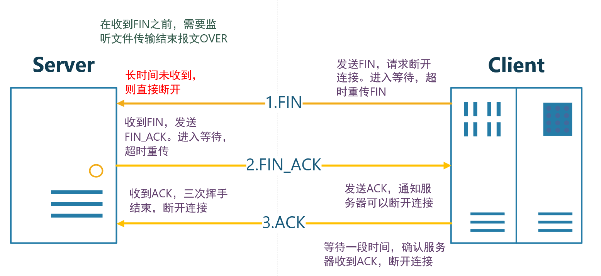

# lab3-1：基于UDP的可靠传输协议
- [lab3-1：基于UDP的可靠传输协议](#lab3-1基于udp的可靠传输协议)
  - [实验设计](#实验设计)
    - [数据报格式](#数据报格式)
  - [流程说明](#流程说明)
    - [三次握手确认连接](#三次握手确认连接)
    - [三次挥手断开连接](#三次挥手断开连接)
    - [rdt3.0发送](#rdt30发送)
    - [rdt3.0接收](#rdt30接收)
  - [辅助函数](#辅助函数)
    - [计算校验和](#计算校验和)
    - [结束传输](#结束传输)
  - [运行结果](#运行结果)
  - [总结](#总结)
    - [连接与断开连接的思考](#连接与断开连接的思考)

## 实验设计
### 数据报格式
设计的数据报格式如下，其中数据头部分为144字节，数据部分最大1024字节。

<center>

| **0-15** | **16-31**  | **32-47** |
|:--------:|:----------:|:---------:|
| CheckSum | Seq        | Ack       |
| Flag     | Length     | SourceIP  |
| DesIP    | SourcePort | DesPort   |
| Data     | Data       | Data      |

</center>

其中，数据头的具体字段含义如下：

```C++
// 数据头
struct Header {
    u_short checksum;  // 16位校验和
    u_short seq;  // 16位序列号，rdt3.0，只有最低位0和1两种状态
    u_short ack;  // 16位ack号，ack用来做确认
    u_short flag;  // 16位状态位 FIN,OVER,FIN,ACK,SYN
    u_short length;  // 16位长度位
    u_short source_ip;  // 16位源ip地址
    u_short des_ip;  // 16位目的ip地址
    u_short source_port;  // 16位源端口号
    u_short des_port;  // 16位目的端口号
};
```

由于采用`rdt3.0`协议，因此序号`seq`只有0和1两种状态，主要由发送端(client)使用；`ack`主要由接收端(server)使用，用来确认接收到的数据报。  

`flag`字段主要在确定连接和断开连接时用于标识数据报，有如下的定义：
    
```C++
const unsigned char SYN = 0x1;  // 00000001
const unsigned char ACK = 0x2;  // 00000010
const unsigned char SYN_ACK = 0x3;  // 00000011
const unsigned char OVER = 0x8;  // 00001000
const unsigned char OVER_ACK = 0xA;  // 00001010
const unsigned char FIN = 0x10;  // 00010000
const unsigned char FIN_ACK = 0x12;  // 00010010
``` 

- `SYN`和`SYN_ACK`用于建立连接时使用。
- `OVER`和`OVER_ACK`用于标识文件传输结束，发送端会在`OVER`数据报后附加文件名。
- `FIN`和`FIN_ACK`用于断开连接时使用。
- `ACK`用于确认接收到的数据报。

具体的使用将在流程说明中介绍。


## 流程说明
### 三次握手确认连接
连接建立流程大致参照TCP三次握手的设计，但不同的是，由于实验**请求连接与发送文件的均是Client端**，因此Client端在发送完第三次握手后，无法通过接收反馈确认连接已建立。  
因此，只能在第三次握手后**等待一段时间**，如果没有收到Server端的超时重传数据报，则认为连接建立成功，进入文件传输阶段。  
整个连接过程也仿照TCP/IP协议设置有**连接计时器**，如果建立连接的时间超过设定时间，则认为连接建立失败，退出程序。


> 1. Client端首先向Server端发送连接请求`SYN`，接着便进入等待。如果超过一个`MAX_TIME`时间没有收到Server端的回复，则重新发送连接请求，直到收到Server端的回复。  
> 2. Server端收到Client端的`SYN`数据保并确认无误后，发送`SYN_ACK`确认连接请求，接着进入等待。如果超过一个`MAX_TIME`时间没有收到Client端的回复，则重新发送`SYN_ACK`确认连接请求，直到收到Client端的回复。  
> 3. Client端收到Server端的`SYN_ACK`确认连接请求后，发送`ACK`确认连接。接着Client会等待2个`MAX_TIME`时间，如果没有再次收到Server端的`SYN_ACK`报文，则认为连接已建立，进入文件传输阶段。而Server端在收到Client端的`ACK`确认连接后，进入文件传输阶段，等待Client端发送数据。

在`rdt3.0`下，`seq`和`ack`两个字段只有0和1两种状态，在连接和断开连接时并没有过多用处。  
上述连接过程中，只有Client端的`seq`进行了一次切换，`ack`只用来确认刚收到的数据报序号。

### 三次挥手断开连接
实验中，数据发送是用Client端进行，因此Client端在发送断开连接请求时，**数据已经完全传输完毕**，所以无需四次握手。  
该过程同样设有定时器，双方都进入了断开连接阶段，如果该阶段持续时间过长，将直接断开连接。



> 1. Client端发送`FIN`断开连接请求，接着进入等待。如果超过一个`MAX_TIME`时间没有收到Server端的回复，则重新发送`FIN`断开连接请求，直到收到Server端的回复。
> 2. Server端收到Client端的`FIN`断开连接请求后，发送`FIN_ACK`确认断开连接。接着进入等待，如果超过一个`MAX_TIME`时间没有收到Client端的回复，则重新发送`FIN_ACK`确认断开连接，直到收到Client端的回复。
> 3. Client端收到Server端的`FIN_ACK`确认断开连接后，发送`ACK`确认断开连接。接着Client会等待2个`MAX_TIME`时间，如果没有再次收到Server端的`FIN_ACK`报文，则认为连接已断开。而Server端在收到Client端的`ACK`后，直接断开连接。

值得一提的是，上述只是**理论上的断开连接阶段**。在代码实现上，Server在确认收到`FIN`数据报之前，需要确认Client已经收到了`OVER_ACK`，双方确认文件传输完毕。  
所以Server虽然已经进入disconnect阶段（**代码实现上的逻辑阶段**），但并不只是发送`FIN_ACK`，如果之前发送的`OVER_ACK`发生了丢包，Server在该阶段还会重传`OVER_ACK`，直到收到`FIN`。

### rdt3.0发送

### rdt3.0接收

## 辅助函数
### 计算校验和

### 结束传输

## 运行结果

## 总结

### 连接与断开连接的思考
